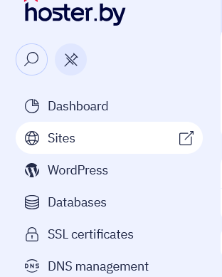
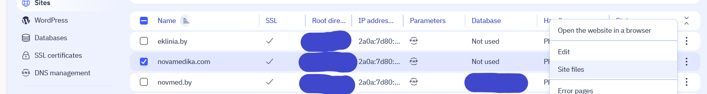
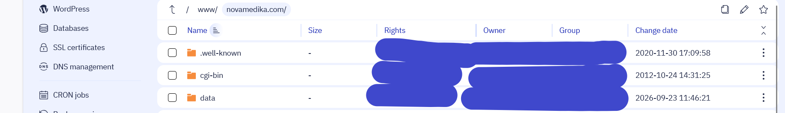
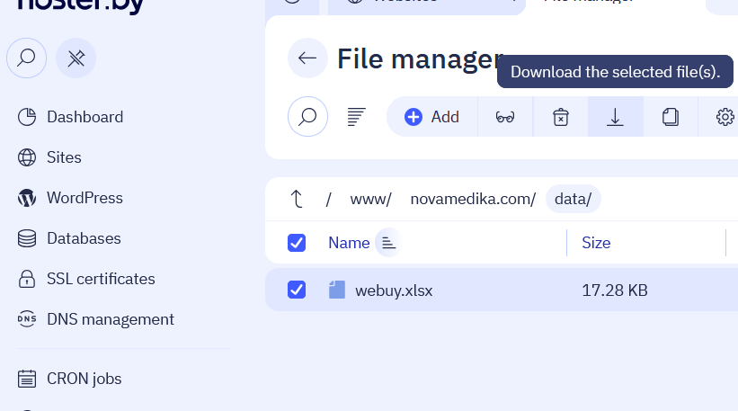
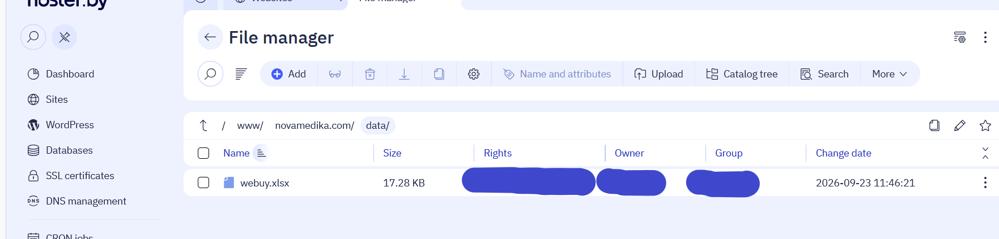
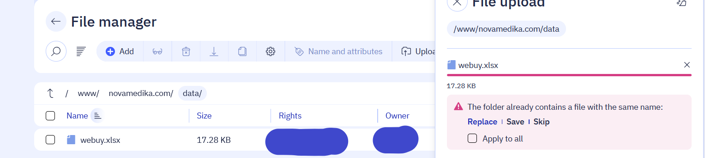

# Как обновить таблицу webuy.xlsx на сайте

Нужен только браузер и Excel (или Google Таблицы, LibreOffice).

---

## Шаг 1. Откройте сайт хостинга

В браузере перейдите на страницу вашего хостинга.

---

## Шаг 2. Нажмите «Управление»

Найдите кнопку **«Управление»** и нажмите её.

---

## Шаг 3. Нажмите «Войти в панель управления»

---

## Шаг 4. Выберите `Sites`

В боковом меню выберите раздел **`Sites`**.

---

## Шаг 5. Откройте `Site Files`

В строке `novamedika.com` нажмите на **три точки справа** и выберите **`Site Files`**.

---

## Шаг 6. Откройте папку `data`

В файловом менеджере найдите папку **`data`** и откройте её двойным кликом.

---

## Шаг 7. Скачайте файл `webuy.xlsx`

1. Поставьте **галочку** слева от файла `webuy.xlsx`.
2. Нажмите кнопку **«Скачать»** (стрелка вниз).

> ✅ Файл сохранится в папку «Загрузки» на вашем компьютере.

---

## Шаг 8. Внесите изменения в файл

Откройте скачанный файл `webuy.xlsx` в **Excel**, **Google Таблицах** или **LibreOffice**. Измените нужные ячейки, добавьте строки.

> ⚠️ **Важно:** сохраняйте файл в формате `.xlsx` и с тем же именем `webuy.xlsx`.
> Не переименовывайте и не меняйте расширение.

---

## Шаг 9. Загрузите файл обратно в папку `data`

1. Вернитесь в файловый менеджер и убедитесь, что вы находитесь в папке `data`.

   

2. **Перетащите** изменённый файл `webuy.xlsx` в эту папку — или нажмите кнопку **«Загрузить»** и выберите файл вручную.

   

3. Когда появится окно с вопросом о замене — нажмите **`Replace`**.

   

> ✅ Обновите страницу сайта — изменения появятся автоматически.

---

## Готово! 🎉

Таблица на сайте обновлена. Если что-то пошло не так — обратитесь к администратору.

---

## Частые проблемы

| Проблема                     | Решение                                                               |
| ---------------------------- | --------------------------------------------------------------------- |
| Не открывается файл `.xlsx`  | Откройте через Excel, Google Таблицы или LibreOffice                  |
| Не получается загрузить файл | Проверьте, что имя файла — `webuy.xlsx`, расширение — `.xlsx`         |
| Изменения не видны на сайте  | Обновите страницу (`Ctrl+F5`). Если не помогло — подождите 1–2 минуты |
| Забыли пароль от панели      | Обратитесь к администратору хостинга                                  |
| Случайно испортили данные    | Обратитесь к администратору — есть резервная копия                    |
